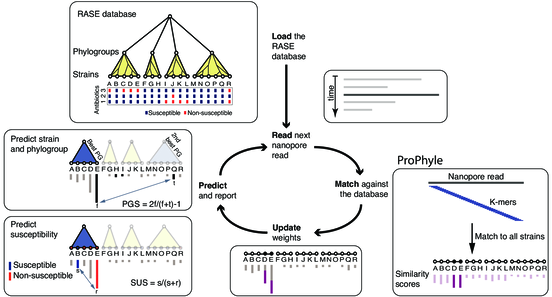

# RASE - Resistance-Associated Sequence Elements

This repository contains data, code, and supplementary information for the
manuscript [Lineage calling can identify antibiotic resistant clones within
minutes](https://www.biorxiv.org/content/early/2018/08/29/403204). For
interactive browsing, see laso the associated [CodeOcean
capsule](https://codeocean.com/2018/10/01/lineage-calling-can-identify-antibiotic-resistant-clones-within-minutes/).

### Citation

> Brinda K, Callendrello A, Cowley L, Charalampous T, Lee R S, MacFadden D R,
> Kucherov G, O'Grady J, Baym M, Hanage W P. **Lineage calling can identify
> antibiotic resistant clones within minutes.** bioRxiv 403204, 2018.
> doi:[10.1101/403204](https://doi.org/10.1101/403204)

## Abstract

Surveillance of circulating drug resistant bacteria is essential for healthcare
providers to deliver effective empiric antibiotic therapy.  However, the
results of surveillance may not be available on a timescale that is optimal for
guiding patient treatment. Here we present a method for inferring
characteristics of an unknown bacterial sample by identifying the presence of
sequence variation across the genome that is linked to a phenotype of interest,
in this case drug resistance. We demonstrate an implementation of this
principle using sequence k-mer content, matched to a database of known genomes.
We show this technique can be applied to data from an Oxford Nanopore device in
real time and is capable of identifying the presence of a known resistant
strain in 5 minutes, even from a complex metagenomic sample. This flexible
approach has wide application to pathogen surveillance and may be used to
greatly accelerate diagnoses of resistant infections.

## Data

* **Results of the RASE pipeline** for all experiments from the paper
  (SP01-SP12) are available in the directory
  [rase-pipeline-results](rase-pipeline-results) . The `prediction`, `plots`,
  and `benchmarks` subdirectories contain prediction time tables, the resulting
  plots (rank plots for `t=1m, 5m, last m` and timeline plot for each
  experiment), and Snakemake benchmarks (time and memory used for individual
  steps of the pipeline).
* **Constructed RASE databases**: The databases are provided as [releases in
  the RASE-DB repository](https://github.com/c2-d2/rase-db/releases).
* **Tables**: Tables and supplementary tables are located in the directory
  [tables](tables).
* **Figures**: Figures and supplementary figures are located in the directory
  [figures](figures).
* **Sequencing data** are available from
  [http://doi.org/10.5281/zenodo.1405173](http://doi.org/10.5281/zenodo.1405173).
  For the metagenomic experiments, only the filtered datasets (i.e., after
  removing the remaining human reads in silico) were made publicly available.
* **Lab notebooks** (sequencing of isolates (SP01-SP06) and additional MIC
  testing) are available from the directory [lab-notebooks](lab-notebooks).

## Code

* [RASE-DB](http://github.com/c2-d2/rase-db). Code for constructing RASE
  databases.
* [RASE-predict](http://github.com/c2-d2/rase-predict). RASE prediction
  pipeline.

## Other links

* [ProPhyle](http://prophyle.github.io). DNA sequence classifier used by RASE.
* [Prophex](http://github.com/prophyle/prophex). k-mer index based on the
  Burrows-Wheeler Transform, used by ProPhyle.

## Reproducibility

All computational steps from the paper are fully reproducible. First, reproduce
the [RASE computational environment](environment.md) (based on
[BioConda](https://bioconda.github.io/)). Then you can either download the
[precomputed RASE database](https://github.com/c2-d2/rase-db/releases/tag/v01),
or [create it from scratch](https://github.com/c2-d2/rase-db). Finally, you can
reproduce the predictions using the [RASE prediction
pipeline](https://github.com/c2-d2/rase-predict) with the [published nanopore
reads](https://zenodo.org/record/1405173).

## License

[MIT](LICENSE).

## Contact

[Karel Brinda](https://scholar.harvard.edu/brinda) \<kbrinda@hsph.harvard.edu\>

