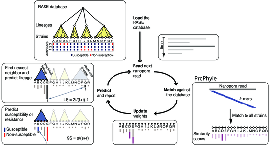

# RASE - Supplementary materials

<!-- vim-markdown-toc GFM -->

* [About](#about)
* [RASE software](#rase-software)
* [RASE databases](#rase-databases)
* [Sequencing data](#sequencing-data)
* [Results](#results)
* [License](#license)
* [Contact](#contact)

<!-- vim-markdown-toc -->

## About

This repository contains data, code, and supplementary information for the
manuscript
*Brinda K, Callendrello A,  Ma KC,  MacFadden DR, Charalampous T,
Lee RS, Cowley L, Wadsworth CB, Grad YH, Kucherov G, O’Grady J, Baym M, and
Hanage WP*: **Rapid heuristic inference of antibiotic resistance and
susceptibility by genomic neighbor typing**, 2019.

<!--
Citation

> Brinda K, Callendrello A, Cowley L, Charalampous T, Lee R S, MacFadden D R,
> Kucherov G, O'Grady J, Baym M, Hanage W P. **Lineage calling can identify
> antibiotic resistant clones within minutes.** bioRxiv 403204, 2018.
> doi:[10.1101/403204](https://doi.org/10.1101/403204)
-->

> Surveillance of drug-resistant bacteria is essential for healthcare providers
  to deliver effective empiric antibiotic therapy. However, traditional
  molecular epidemiology does not typically occur on a timescale that could
  impact patient treatment and outcomes. Here we present a method called
  ‘genomic neighbor typing’ for inferring the phenotype of a bacterial sample
  by identifying its closest relatives in a database of genomes with metadata.
  We show that this technique can infer antibiotic susceptibility and
  resistance for both *S. pneumoniae* and *N. gonorrhoeae*. We implemented this
  with rapid *k*-mer matching, which, when used on Oxford Nanopore MinION data,
  can run in real time. This resulted in determination of resistance within ten
  minutes (sens/spec 91%/100% for *S. pneumoniae* and 81%/100% for *N.
  gonorrhoeae* from isolates with a representative database) of sequencing
  starting, and for clinical metagenomic sputum samples (75%/100% for *S.
  pneumoniae*), within four hours of sample collection. This flexible approach
  has wide application to pathogen surveillance and may be used to greatly
  accelerate appropriate empirical antibiotic treatment.

## RASE software

* [RASE pipeline](http://github.com/c2-d2/rase-pipeline). RASE pipeline.
* [RASE](http://github.com/c2-d2/rase). Core RASE software package.
* [RASE DB skeleton](https://github.com/c2-d2/rase-db-skeleton). Skeleton for
  creating novel databases.

## RASE databases

* [*S. pneumoniae SPARC*](https://github.com/c2-d2/rase-db-spneumoniae-sparc) ([releases](https://github.com/c2-d2/rase-db-spneumoniae-sparc/releases))
* [*N. gonorrhoeae GISP*](https://github.com/c2-d2/rase-db-ngonorrhoeae-gisp) ([releases](https://github.com/c2-d2/rase-db-ngonorrhoeae-gisp/releases))

## Sequencing data

* **Sequencing data** are available from
  [http://doi.org/10.5281/zenodo.1405173](http://doi.org/10.5281/zenodo.1405173).
  For the metagenomic experiments, only the filtered datasets (i.e., after
  removing the remaining human reads in silico) were made publicly available.

## Results

* **Tables**: Tables and supplementary tables are located in the directory
  [tables](tables).
* **Figures**: Figures and supplementary figures are located in the directory
  [figures](figures).
* **Lab notebooks** (sequencing of isolates (SP01-SP06) and additional MIC
  testing) are available from the directory [lab-notebooks](lab-notebooks).

<!--
Reproducibility

All computational steps from the paper are fully reproducible. First, reproduce
the [RASE computational environment](environment.md) (based on
[BioConda](https://bioconda.github.io/)). Then you can either download the
[precomputed RASE database](https://github.com/c2-d2/rase-db/releases/tag/v01),
or [create it from scratch](https://github.com/c2-d2/rase-db). Finally, you can
reproduce the predictions using the [RASE prediction
pipeline](https://github.com/c2-d2/rase-predict) with the [published nanopore
reads](http://doi.org/10.5281/zenodo.1405172).
-->

## License

[MIT](LICENSE).

## Contact

[Karel Brinda](https://scholar.harvard.edu/brinda) \<kbrinda@hsph.harvard.edu\>

